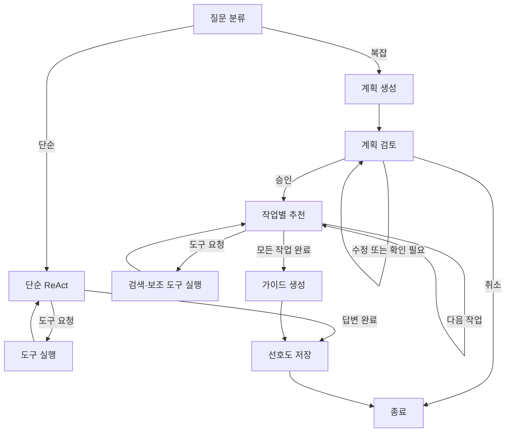

# AI 101 — AI 도구 추천 에이전트

사용자의 작업을 세부 단계로 나누고, 각 단계에 적합한 AI 서비스를 검색해 사용 가이드를 만드는 **LangGraph 기반 에이전트**입니다. 복잡한 요청은 계획을 먼저 보여주고, 사용자가 승인한 뒤 추천을 진행합니다.

생성형 AI 응용 수업의 팀 프로젝트에서 출발했습니다. 아래에 초기 팀원별 기여를 기록하고, 후속 리팩터링의 내용은 별도로 정리했습니다.

## 사용 흐름

- **단순 질문**: 필요한 계산·시간·검색 도구를 사용하고 바로 답변합니다.
- **복잡한 작업**: 계획 생성 → 사용자 검토 → 단계별 도구 추천 → 최종 가이드로 이어집니다.
- **계획 수정**: 바뀐 계획을 다시 보여줍니다. **재승인하기 전에는 추천 도구를 실행하지 않습니다.**
- **취소·모호한 응답**: 취소는 실행을 끝내고, 모호한 응답이나 의도 분석 실패는 승인 대기를 유지합니다.
- **선호도 저장**: 대화에서 명시적으로 확인한 선호도를 사용자 ID별 ChromaDB 프로필에 저장합니다.

예를 들어 `무료 AI 도구로 유튜브 쇼츠를 만들고 싶어`라고 요청한 뒤, 제시된 계획에 `2번은 빼줘`라고 답하면 수정된 계획을 검토할 수 있습니다. 단순 계산인 `22 * 34 알려줘`는 승인 절차 없이 답변합니다. 실제 라우팅과 생성 결과는 모델에 따라 달라집니다.

## 실행

Python **3.11 이상**과 [uv](https://docs.astral.sh/uv/)를 사용합니다. 로컬 검증 환경은 Python 3.12이며, CI에는 3.11·3.12 검사를 설정했습니다.

```bash
git clone https://github.com/mousepotato03/langraph_agent.git
cd langraph_agent
uv sync --frozen --all-extras
cp .env.example .env
```

`.env`의 `OPENAI_API_KEY`에 본인 키를 설정한 뒤 실행합니다.

```bash
uv run --frozen --all-extras python main.py
```

- 채팅 화면: http://127.0.0.1:7860/
- API 문서: http://127.0.0.1:7860/docs
- 상태 확인: http://127.0.0.1:7860/health

처음 시작하면 임베딩 모델을 다운로드하고, 카탈로그와 PDF를 ChromaDB에 색인합니다. OpenAI 호출에는 사용량에 따른 비용이 발생합니다. Google 검색 키를 설정하지 않으면 로컬 검색과 일반 답변은 사용할 수 있지만 웹 검색은 사용할 수 없습니다.

pip를 사용할 경우 `python -m pip install -r requirements.txt`로 설치할 수 있습니다. 정확히 고정된 의존성으로 재현하려면 `uv.lock`을 사용하는 위 명령을 권장합니다.

### 환경 변수

| 변수 | 용도 | 기본값 |
| --- | --- | --- |
| `OPENAI_API_KEY` | 답변·계획·선호도 추출 | 필수 |
| `LLM_MODEL` | OpenAI 모델 | `gpt-4o-mini` |
| `GOOGLE_API_KEY` | Google Custom Search API 키 | 선택 |
| `GOOGLE_SEARCH_ENGINE_ID` | 검색 엔진 ID | 선택 |
| `EMBEDDING_MODEL` | 다국어 임베딩 모델 | `paraphrase-multilingual-MiniLM-L12-v2` |
| `DATA_PATH` / `DB_PATH` | 데이터 / 저장소 경로 | 저장소의 `data/` / `db/` |
| `HOST` / `PORT` | 서버 주소 / 포트 | `127.0.0.1` / `7860` |
| `SESSION_TTL_SECONDS` | 승인 대기 세션의 유효 시간 | `3600` |
| `MAX_ACTIVE_SESSIONS` | 동시에 보관하는 세션 상한 | `100` |

`.env`는 Git에서 제외되며, 설정 예시는 [.env.example](.env.example)에 있습니다. 경로를 따로 지정하지 않으면 현재 작업 디렉토리와 관계없이 저장소의 기본 경로를 사용합니다.

## 그래프와 실행 구조



- [agent/graph.py](agent/graph.py)는 노드와 분기를 조립합니다. 모델·메모리·도구 실행기는 [AgentDependencies](agent/dependencies.py)로 교체할 수 있습니다.
- [approval.py](agent/nodes/approval.py)의 `interrupt()`가 검토 상태를 체크포인트에 저장합니다. `Command(resume=...)`으로 승인·수정·취소를 전달합니다. 수정은 새 검토 단계로 돌아갑니다.
- [app/service.py](app/service.py)는 세션과 실행 결과를 관리하며, FastAPI와 Gradio가 함께 사용합니다. 중복 승인, 만료된 세션, 사용 중인 스레드 ID를 구분합니다.
- [tool_execution.py](agent/tool_execution.py)는 모든 도구 호출에 원래 ID와 일치하는 `ToolMessage`를 반환합니다. 실패·알 수 없는 도구·호출 한도 초과에도 호출과 응답의 짝을 보존합니다.
- 작업별 메시지와 검색 근거는 다음 작업에서 초기화하고, 전체 근거는 최종 가이드에 남깁니다. 도구 실행 목록과 모델에 바인딩하는 목록은 하나의 레지스트리를 사용합니다.

LangGraph의 승인·재개 동작은 [공식 interrupts 문서](https://docs.langchain.com/oss/python/langgraph/interrupts)에 설명되어 있습니다.

## 검색 방식과 데이터

[data/ai_tools.json](data/ai_tools.json)에 **60개 AI 도구**가 있고, `data/`의 PDF 두 파일을 보조 지식베이스로 사용합니다.

1. 작업과 도구 카탈로그 사이의 벡터 유사도로 후보를 최대 5개 검색합니다.
2. 각 후보의 도구명·카테고리로 PDF를 검색해 평균 유사도를 계산합니다.
3. `final_score = JSON 유사도 × 0.7 + PDF 관련도 × 0.3`으로 후보를 정렬합니다.
4. JSON 검색의 최고 점수가 `0.4` 미만이거나 후보 평균이 `0.5` 미만이면 웹 검색이 필요한 상태로 표시합니다. 추천 노드가 Google 검색을 추가로 요청할 수 있습니다.

이 가중치는 기존 구현의 **휴리스틱**입니다. 추천 품질을 측정한 정확도나 확률이 아니며, PDF 관련도만으로 도구가 문서에 직접 언급되었다고 판단하지 않습니다. `hybrid_search(include_pdf=False)`는 PDF 점수 없이 JSON 유사도만 사용합니다.

카테고리는 [core/categories.py](core/categories.py)의 명시적인 별칭을 적용합니다. 예를 들어 데이터의 `Video AI`를 `video-generation`으로 검색할 수 있습니다. ChromaDB에는 지원하지 않는 문자열 `$contains` 필터를 전달하지 않습니다.

카탈로그에 출처 URL과 수집 날짜가 있으면 최종 가이드의 근거로 전달합니다. **카탈로그의 가격·기능은 수집 당시의 정보이며 현재 정보와 다를 수 있습니다.** 웹 검색이 불가능하거나 충분한 근거가 없을 때는 추가 확인이 필요하다는 한계를 답변에 남기도록 프롬프트를 구성했습니다.

## API 예시

### 요청 시작

```bash
curl -X POST http://127.0.0.1:7860/chat/start \
  -H 'Content-Type: application/json' \
  -d '{"query":"무료 도구로 쇼츠를 만들고 싶어","user_id":"demo-user"}'
```

`status`가 `completed`이면 `final_guide`에 단순 질문의 최종 답변이 있습니다. `pending_approval`이면 응답의 `thread_id`와 `plan`을 사용해 검토를 진행합니다.

### 승인

```bash
curl -X POST http://127.0.0.1:7860/chat/approve \
  -H 'Content-Type: application/json' \
  -d '{"thread_id":"응답에서 받은 ID","user_id":"demo-user","action":"approve"}'
```

수정은 `action: "modify"`와 `feedback`을, 취소는 `action: "cancel"`을 전달합니다. 수정 응답은 `pending_approval`이며, 같은 스레드를 다시 승인해야 추천이 시작됩니다. API의 명시적인 `action`은 LLM으로 재분류하지 않습니다. Gradio의 자연어 응답만 의도 분석을 거칩니다.

| 상황 | 응답 |
| --- | --- |
| 유효하지 않은 action / 내용 없는 수정 요청 | `422` |
| 만료·완료된 세션 또는 다른 사용자 ID | `404` |
| 중복 실행 / 이미 사용 중인 thread_id | `409` |
| 세션 보관 상한 초과 | `503` |
| 응답 생성 실패 | `502`, 상세 원인은 서버 로그에 기록 |

`action`은 필수입니다. 시작 요청에서 별도 `user_id`를 사용했다면 승인 요청에도 같은 ID를 전달해야 합니다. `/chat/start`는 새 요청을 시작하며, 기존 승인 대기 세션을 같은 ID로 덮어쓰지 않습니다. Gradio는 화면의 대화 기록을 다음 요청에 전달합니다.

## 검증

API 키와 임베딩 모델 다운로드 없이 검증할 수 있습니다. 의존성 설치 이후의 테스트 실행에는 외부 모델·검색 호출이 필요하지 않습니다.

```bash
uv sync --frozen
uv run --frozen pytest -q
uv run --frozen ruff check .
uv run --frozen ruff format --check .
```

테스트는 실제 LangGraph로 계산 → 도구 응답 → 최종 답변을 실행하고, 승인 전 중단·수정 후 재검토·취소·실패 처리를 확인합니다. 실제 ChromaDB와 생성한 테스트 PDF로 카테고리 필터·PDF 색인·프로필 저장을 검증합니다. 임베딩과 LLM 응답은 테스트 어댑터를 사용합니다.

[CI](.github/workflows/ci.yml)는 같은 검사를 실행합니다. **실제 OpenAI·Google API 호출과 실제 임베딩 모델의 추천 품질은 이 테스트의 검증 범위에 포함되지 않습니다.**

## 구조

| 경로 | 책임 |
| --- | --- |
| `agent/` | 그래프, 상태, 승인, ReAct, 최종 가이드와 Reflection |
| `app/service.py` | API·UI가 공유하는 세션과 실행 흐름 |
| `app/api/` / `app/ui/` | HTTP 스키마·엔드포인트 / Gradio 화면 |
| `core/` | 환경 설정, 모델 팩토리, ChromaDB, 출력 검증 |
| `tools/` | 검색·계산·시간·프로필 도구와 레지스트리 |
| `prompts/` | 분류·계획·추천·가이드·의도 분석 프롬프트 |
| `data/` / `tests/` | 원본 카탈로그·PDF / 외부 호출 없는 회귀 테스트 |

## 현재 한계

- 승인 대기 세션과 체크포인트는 **프로세스 메모리**에 있습니다. 서버를 재시작하면 사라지므로 현재는 단일 프로세스로 실행합니다. 세션 만료는 다음 서비스 요청에서 정리합니다. 장기 프로필과 검색 색인은 ChromaDB에 남습니다.
- `user_id`는 프로필을 구분하는 논리적인 식별자이며 인증 수단이 아닙니다. 외부 서비스로 공개하려면 인증과 영속적인 세션 관리가 필요합니다.
- 기존 색인에 데이터가 있으면 시작 시 다시 색인하지 않습니다. JSON·PDF를 변경하면 검색 컬렉션을 재색인해야 하며, 사용자 프로필 컬렉션은 별도로 보존해야 합니다.
- 검색 가중치와 임계값은 실제 질의 평가셋으로 조정하지 않았습니다. 추천 품질·지연 시간·호출 비용을 개선하려면 평가셋과 실측이 필요합니다.

## 팀 기여와 후속 정리

초기 프로젝트: **생성형 AI 응용 FINAL PROJECT / AI 101**

팀장: 박승진 · 팀원: 고대욱, 김성겸, 주소영

| 이름 | 초기 프로젝트 담당 |
| --- | --- |
| **박승진** | PDF 데이터 수집, Recommend Tool 노드의 RAG·Google Search, Gradio mount |
| 고대욱 | Human Approval 인터럽트, Reflection 메모리, conditional edge |
| 김성겸 | Guide Generation의 Google Search, Simple LLM 노드 |
| 주소영 | LLM Router, Planning, 계산기·시간 도구의 Simple Tool Executor |

후속 정리에서는 승인 상태를 그래프 안에서 관리하고, API·UI의 실행 서비스를 통합했습니다. 계산 도구 누락, 호출 ID 불일치, 작업 사이의 검색 근거 혼입, 카테고리 필터와 검색 옵션을 수정했으며, 의존성 고정·회귀 테스트·CI를 추가했습니다. 이 정리는 위 표의 초기 팀원별 기여와 구분합니다.
